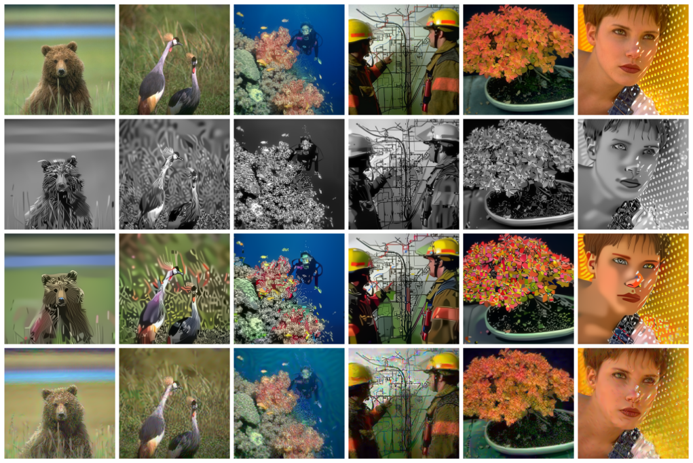

# Total Deep Variation Regularizer

Here, we showcase the *total deep variation* (TDV) regularizer introduced in 
 - E. Kobler, A. Effland, K. Kunisch, and T. Pock, [*Total deep variation for linear inverse problems*](https://arxiv.org/abs/2001.05005), in IEEE Conference on Computer Vision and Pattern Recognition, 2020.

If you use this code please cite:

```bibtex
@InProceedings{KoEf20,
  Title     = {Total Deep Variation for Linear Inverse Problems},
  Author    = {Kobler, Erich and Effland, Alexander and Kunisch, Karl and Pock, Thomas},
  Booktitle = {IEEE Conference on Computer Vision and Pattern Recognition},
  Year      = {2020}
}
```

## Overview
    .
    +-- ddr               : data driven regularizers module
    | +-- conv.py         : implementation of forward/backward convolution operators
    | +-- regularizer.py  : interface for regularizers
    | +-- tdv.py          : implementation of the TDV regularizer
    +-- data              : sample images
    +-- checkpoints       : pytorch checkpoint files
    +-- figures           : figures for plotting
    +-- denoise.py        : simple script to run gray-scale/color denoising
    +-- eigenfunctions.py : visualization of an eigenfunction of the TDV regularizer

## Requirements
- numpy
- imageio
- pytorch
- scikit-image
- [optox](https://github.com/VLOGroup/optox)
- matplotlib

## Gaussian Image Denoising


## Single Image Super-resolution


## Non-linear Eigenfunction Analysis

